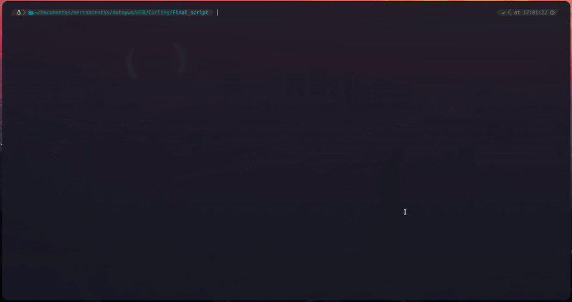

# CURLING AUTPWN SCRIPT

## PREVIEW



## DESCRIPTION

This script will pwn Curling automatically, just spawn the machine, exec the script and wait for the magic to happen.

## INSTALL

### DEBIAN BASED
```
wget https://github.com/Void4m0n/AutoPWN_HTB/raw/main/Curling/Curling_Autopwn_repo.zip
unzip Curling_Autopwn_repo.zip
cd Curling
chmod +x ./setup.sh
./setup.sh
```
## USAGE

```
python3 Curling_Autopwn.py
```
## PWN SCHEME

- [1] Get the user from the post
- [2] Get the credential allocated in /secret.txt
- [3] Login as Admin in Joomla
- [4] Update php template achieving RCE
- [5] Download the password backup and extract the password:
    - [5.1] bin --> bzip2 --> gunzip --> bzip2 --> tar --> Secret.txt 
- [6] Login through ssh and retrieve USER.TXT flag
- [7] Exploit the cron task that allow the arbitrary root write/read perm and get ROOT.TXT
